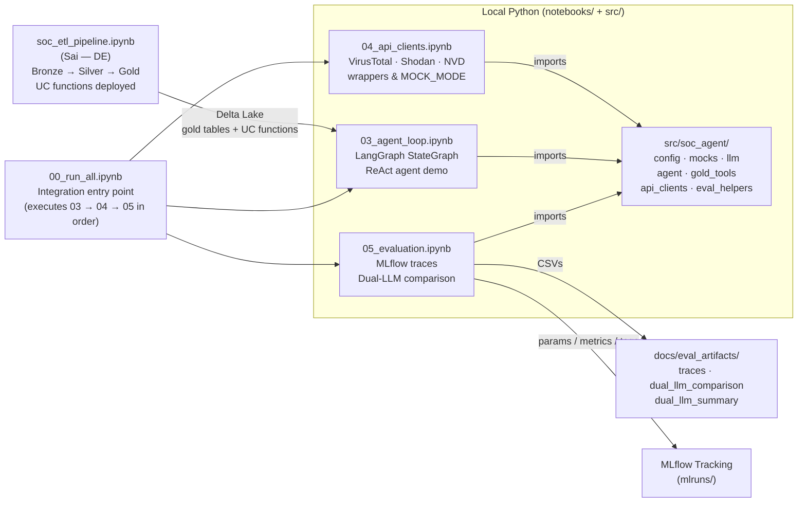
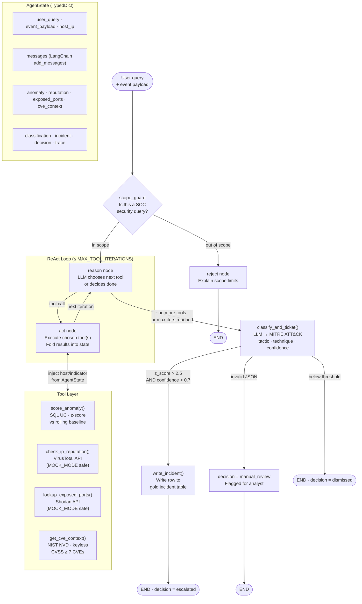

# SOC Triage Agent

**AAI-510 Agentic AI Systems — Final Team Project**
University of San Diego, MS Applied Artificial Intelligence

[Project Proposal (PDF)](proposal_cybersecurity_agent.pdf)

## Team

| Name | Role | Responsibilities |
|------|------|-----------------|
| Marston Ward | Team Lead / AI Engineer | Agent loop, API integrations, evaluation |
| Sai Bandi | Data Engineer | ETL pipeline, Unity Catalog functions |
| Marquise Oliver | Product Manager | Business case, ROI analysis, build-vs-buy |

## Problem

NovaPay Financial is a mid-sized U.S. payments processor whose Security Operations Center (SOC) faces an unsustainable alert workload. Each analyst manually reviews 30–50 alerts per shift, spending 30–45 minutes on repetitive IP lookups, CVE cross-references, and threat classification that a machine could handle in seconds. High-severity threats routinely get buried under routine noise, increasing mean time to detect (MTTD) and mean time to respond (MTTR).

## Solution

An autonomous SOC triage agent that:

1. **Monitors** SIEM event logs stored in Delta Lake for anomalous activity
2. **Scores** each event against a rolling statistical baseline
3. **Enriches** suspicious source IPs with external threat intelligence (VirusTotal, Shodan, NVD)
4. **Classifies** threats using the MITRE ATT&CK framework
5. **Generates** fully labeled incident tickets, ready for human analyst review

The agent follows the **ReAct** (Reasoning + Acting) pattern, interleaving chain-of-thought reasoning with tool calls so every decision is traceable and auditable.

## Architecture

```
┌─────────────────────────────────────────────────────────┐
│                   LangGraph ReAct Agent                 │
│                                                         │
│   Observe ──► Reason ──► Act ──► Observe ──► ...        │
│                          │                              │
│               ┌──────────┴──────────┐                   │
│               ▼                     ▼                   │
│         UC SQL Functions      External APIs             │
│  ┌──────────────────────┐  ┌─────────────────────┐      │
│  │ score_anomaly()      │  │ check_ip_reputation()│     │
│  │ get_cve_context()    │  │ lookup_exposed_ports()│    │
│  │ classify_threat()    │  └─────────────────────┘      │
│  │ get_exposed_assets() │                               │
│  └──────────────────────┘                               │
│               │                                         │
│               ▼                                         │
│      classify_and_ticket()                              │
│      (Python UC + LLM → MITRE-labeled ticket)           │
└─────────────────────────────────────────────────────────┘
```

### Notebook Pipeline

How the notebooks and the reusable package connect end-to-end:

The pipeline begins in **Databricks** with `soc_etl_pipeline.ipynb`, where Sai's DE work runs the Bronze → Silver → Gold medallion ETL and deploys the Unity Catalog SQL functions (`score_anomaly`, `classify_threat`, `get_exposed_assets`). The resulting Gold Delta tables and UC functions are the data contract handed off to the AIE layer.

On the local Python side, **`00_run_all.ipynb`** is the single integration entry point — it executes the three AIE notebooks in order. **`04_api_clients.ipynb`** exercises the external-API wrappers (VirusTotal, Shodan, NVD) in isolation. **`03_agent_loop.ipynb`** runs the LangGraph ReAct agent end-to-end against live or mock data. **`05_evaluation.ipynb`** replays the same traces through two LLM configurations and records params, metrics, and artifacts. All three notebooks import from `src/soc_agent/`, the reusable package that contains every module (`config`, `mocks`, `llm`, `agent`, `gold_tools`, `api_clients`, `eval_helpers`). Evaluation output flows in two directions: structured CSVs land in `docs/eval_artifacts/` for submission, and MLflow logs params/metrics/tags to `mlruns/` for experiment tracking.



### Agent Internals — ReAct Loop

How the LangGraph `StateGraph` agent is built and what happens at runtime:

Every run starts with a **scope guard** node that performs a deterministic keyword check on the incoming query. If the query is unrelated to SOC/security triage it is immediately rejected with an explanation — no LLM call is made and execution ends. Injecting an `event_payload` dict always bypasses this check, so programmatic callers always proceed.

In-scope queries enter the **ReAct loop**: the `reason` node sends the current conversation context to the LLM, which picks the next tool to call. The `act` node executes that tool, injects the host IP or indicator from `AgentState` so mock calls with empty arguments still work, and folds the normalized result back into state. The loop repeats until the LLM declares it is done or the iteration cap (`MAX_TOOL_ITERATIONS`) is reached. The four tools available to the LLM are:

- **`score_anomaly()`** — calls the Gold Unity Catalog SQL function; returns a z-score against the rolling per-host baseline.
- **`check_ip_reputation()`** — queries VirusTotal for threat scores; falls back to mock fixtures when `MOCK_MODE=true`.
- **`lookup_exposed_ports()`** — queries Shodan for open ports and service banners; same MOCK_MODE fallback.
- **`get_cve_context()`** — searches NIST NVD (keyless) and returns CVEs with CVSS ≥ 7 for a given keyword.

All tool results accumulate in `AgentState` — a `TypedDict` that tracks the query, raw event payload, host IP, the full LangChain message list, and every enrichment field (`anomaly`, `reputation`, `exposed_ports`, `cve_context`).

Once the loop exits, **`classify_and_ticket()`** sends all accumulated context to the LLM and asks for a MITRE ATT&CK label (tactic, technique ID, severity, confidence). The decision branches on two thresholds:

- **Escalate** (`z_score > 2.5 AND confidence > 0.7`): `write_incident()` inserts a row into `gold.incident` matching the exact UC schema. The final decision is `escalated`.
- **Manual review** (LLM returns invalid JSON or flags `MANUAL_REVIEW`): the incident is flagged for a human analyst. Decision is `manual_review`.
- **Dismiss** (below threshold): no ticket is written. Decision is `dismissed`.

Every step appends a human-readable note to the `trace` list in state, giving auditors a step-by-step explanation of the agent's reasoning without reading raw LLM messages.



### Tool Inventory

| Tool | Type | Description |
|------|------|-------------|
| `score_anomaly()` | SQL UC function | Z-score anomaly detection against a rolling baseline |
| `get_cve_context()` | SQL UC function | CVE lookup from NIST NVD data |
| `check_ip_reputation()` | Python / API | IP threat scoring via VirusTotal |
| `lookup_exposed_ports()` | Python / API | Open-port enumeration via Shodan |
| `classify_and_ticket()` | Python UC + LLM | Generates MITRE ATT&CK-labeled incident tickets |

### LLM Comparison

The agent is evaluated with **two LLMs on the same traces**. The provider and both
model names are **fully configurable via environment variables** (`LLM_PROVIDER`,
`LLM_MODEL`, `LLM_MODEL_B`) — no code edits to switch. The locked default is two
**Databricks-served** models (OpenAI-compatible client → Databricks Model Serving):

| Slot | Default model | Provider | Notes |
|------|---------------|----------|-------|
| `LLM_MODEL` (A) | `databricks-meta-llama-3-3-70b-instruct` | Databricks Model Serving | open-weight (Llama 3.3) |
| `LLM_MODEL_B` (B) | `databricks-meta-llama-3-3-70b-instruct` | Databricks Model Serving | same endpoint, temp=0.5 (sampling vs deterministic) |

Set `LLM_PROVIDER=openai` (with `LLM_MODEL=gpt-4o-mini`, `LLM_MODEL_B=gpt-4o`) to
compare against OpenAI instead. With no creds, a built-in `mock` provider runs the
whole comparison offline.

## Data Sources

- **OTRF Security Datasets** — Open Threat Research Forge simulated attack telemetry covering MITRE ATT&CK tactics (execution, persistence, lateral movement, credential access, discovery, privilege escalation, command & control)
- **NIST NVD** — National Vulnerability Database CVE feeds for vulnerability enrichment

## Tech Stack

| Layer | Technology |
|-------|-----------|
| Data Platform | Databricks, Delta Lake, Unity Catalog |
| Orchestration | LangGraph (ReAct pattern) |
| Experiment Tracking | MLflow |
| Data Processing | PySpark |
| External Intelligence | VirusTotal API, Shodan API, NIST NVD |
| LLM Providers | Databricks Model Serving (Llama-3.3-70B @ temp=0.0 vs temp=0.5); OpenAI (GPT-4o-mini) also supported |

## Current Progress

### Data Pipeline (Sai Bandi — DE) ✅ Complete

Medallion architecture ETL pipeline delivering production-ready analytics tables,
now fully **deployed and scheduled on Databricks serverless** (see
[Data Lake Architecture](#data-lake-architecture) and [Jobs & Scheduling](#jobs--scheduling)).

- **Bronze → Silver → Gold** transformation pipeline, self-downloads OTRF data from GitHub
- Ingests OTRF Security Datasets covering **7 MITRE ATT&CK tactics**
- **51,400 raw events → 40,833 normalized rows** across 10 hosts and 44 user accounts
- **Incremental silver normalization** — watermark-based, only processes new bronze rows
- **Five Gold-layer Unity Catalog functions** deployed:
  - `score_anomaly()` — SQL TVF, z-score anomaly detection
  - `classify_threat()` — Python UDF, MITRE ATT&CK rule-based classification
  - `get_exposed_assets()` — SQL TVF, host-level risk assessment
  - `check_ip_reputation()` — **SQL + `http_request()`**, AbuseIPDB via governed HTTP connection
  - `lookup_exposed_ports()` — **SQL + `http_request()`**, Shodan via governed HTTP connection
- **Governed external access** — UC HTTP connections (`abuseipdb_http`, `shodan_http`),
  host-locked and auditable; API keys injected at query time via `SECRET()` (never in code)
- Unity Catalog: `soc_intelligence` catalog with `bronze`, `silver`, and `gold` schemas
- **Infrastructure-as-code**: `databricks/setup_infrastructure` (idempotent bootstrap) +
  `databricks/deploy_jobs` (creates + schedules all jobs from a fresh git checkout)

### Agent Definition (Marston Ward — AIE) ✅ Complete

Runs as **local Python** (`notebooks/` + reusable `src/soc_agent/`), **MOCK_MODE
by default** — executes end-to-end with **zero API keys and zero live Databricks**.

- Concrete LangGraph **`StateGraph`** ReAct agent — explicit State, nodes, tools,
  edges (`notebooks/03_agent_loop.ipynb`, `src/soc_agent/agent.py`)
- API client wrappers for **VirusTotal, Shodan, and NVD/CVE** with MOCK_MODE,
  retries/timeouts, and graceful errors (`notebooks/04_api_clients.ipynb`)
- `classify_and_ticket()` — LLM-driven MITRE ATT&CK labeling that writes a row
  matching the **exact `gold.incident` schema** (escalates when
  `z_score > 2.5 AND confidence > 0.7`; invalid JSON → manual review)
- **Out-of-scope query rejection** with 2 explicit worked examples
- **Fully configurable LLM** provider/models via env (`get_llm()` factory):
  `databricks` (default) / `openai` / `mock`

### Evaluation (Marston Ward — AIE) ✅ Complete

`notebooks/05_evaluation.ipynb` + `src/soc_agent/eval_helpers.py`:

- **5 MLflow traces** (3 in-scope escalations + 2 out-of-scope rejections) with
  params/tags/metrics and `mlflow.trace` spans
- **Same-trace, two-LLM comparison** — both model names read from config so a
  grader can point it at any two Databricks endpoints; side-by-side table +
  summary (mean confidence/priority/latency, tactic agreement)
- Artifacts saved to `docs/eval_artifacts/`

> **Note — `get_cve_context` ownership.** Per the proposal this NVD tool is
> **officially Sai's (DE)** but was never registered as a UC function. It is
> implemented here as a keyless NVD Python tool and **should be migrated to a UC
> function later**.
>
> **Note — `score_anomaly` signature drift.** The shipped gold function is a
> **table-valued** `score_anomaly(p_host_ip, p_window_min INT)` with the window in
> **minutes** (not the dict-keyed-by-days the proposal contract promised). The tool
> wrappers adapt to what actually shipped; `top_anomaly()` normalizes the TVF rows
> to a single `{z_score, ...}` dict for the agent.

### Run locally (mock mode, zero creds)

```bash
python -m pip install -r requirements.txt
python -m ipykernel install --user --name soc-agent --display-name "SOC Agent (Databricks)"
jupyter nbconvert --to notebook --execute --inplace \
  --ExecutePreprocessor.kernel_name=soc-agent notebooks/00_run_all.ipynb
```

Full instructions (env vars, switching to live Databricks, selecting LLM
provider/models) are in **[`docs/SETUP.md`](docs/SETUP.md)**. AIE component
summary: **[`docs/aie_writeup.md`](docs/aie_writeup.md)**.

### Business Case (Marquise Oliver — PM) ⏳ In Progress

- ROI calculation for automated triage vs. manual analyst workflow
- Build-vs-buy justification for NovaPay Financial

---

## Data Lake Architecture

Unity Catalog `soc_intelligence`, medallion (Bronze → Silver → Gold), all on
Databricks **serverless** (no classic clusters available in this workspace).

```
soc_intelligence  (Unity Catalog)
│
├── bronze/                                      RAW -- append only
│   ├── siem_raw_event        OTRF JSON + mock events (original field names, @timestamp)
│   └── otrf_raw  (Volume)     downloaded OTRF ZIP files
│
├── silver/                                      NORMALIZED -- incremental (watermark)
│   ├── siem_normalized       filtered to 13 priority EventIDs, standardized columns
│   ├── host                   asset inventory (distinct hosts)
│   └── user_account           identities from logon/creation events (4624/4720)
│
└── gold/                                        COMPUTED
    ├── score_anomaly()        SQL TVF   -- z-score vs 24h rolling baseline
    ├── classify_threat()      Python UDF-- EventID/process -> MITRE tactic
    ├── get_exposed_assets()   SQL TVF   -- host risk flags
    ├── check_ip_reputation()  SQL+HTTP  -- AbuseIPDB via abuseipdb_http connection
    ├── lookup_exposed_ports() SQL+HTTP  -- Shodan via shodan_http connection
    ├── incident               Delta     -- agent-generated ATT&CK-labeled tickets
    └── incident_eval          Delta     -- automated quality grades for incidents
```

### Governed external access (AbuseIPDB / Shodan)

Network egress from a Unity Catalog **Python UDF is sandboxed** (no outbound
internet). The threat-intel lookups are therefore implemented as **SQL functions**
that call the built-in `http_request()` over UC **HTTP connections**:

```
CREATE CONNECTION abuseipdb_http TYPE HTTP OPTIONS (host 'https://api.abuseipdb.com', ...)
CREATE CONNECTION shodan_http    TYPE HTTP OPTIONS (host 'https://api.shodan.io',   ...)

CREATE FUNCTION gold.check_ip_reputation(ip STRING) RETURNS STRING
  RETURN http_request(conn => 'abuseipdb_http', ...,
                      headers => map('Key', SECRET('mcp-keys','abuseipdb-key'), ...)).text
```

- **Host-locked & auditable** — each connection can only reach its one allowed host
- **No keys in code** — injected at query time via `SECRET('mcp-keys', ...)`
- **Callable anywhere** — SQL, notebooks, or the agent

> Note: this uses Databricks `CREATE CONNECTION TYPE HTTP` + `http_request()` —
> NOT `CREATE NETWORK ACCESS CONFIGURATION` / `CREATE EXTERNAL ACCESS INTEGRATION`,
> which are not valid SQL DDL in this workspace.

---

## Jobs & Scheduling

All jobs run on **serverless** compute and are provisioned by
`databricks/deploy_jobs` (idempotent, self-locating).

| Job | Trigger | Notebook | Role |
|-----|---------|----------|------|
| `setup_infrastructure` | **ON-DEMAND** | `databricks/setup_infrastructure` | One-time bootstrap: catalog, schemas, volume, UC functions, HTTP connections, tables |
| `mock_event_injector_v2` | every **1 min** | `databricks/mock_event_injector` | Generate synthetic SIEM events → `bronze.siem_raw_event` |
| `soc_etl_pipeline_v2` | every **2 min** | `databricks/soc_etl_pipeline` | Incremental Bronze → Silver normalization |
| `soc_agent_live` | every **5 min** | `databricks/soc_agent_live` | LangGraph agent + dual LLM + MLflow + governed enrichment → `gold.incident` |
| `incident_eval_agent_v2` | every **5 min +30s** | `databricks/incident_eval_agent` | Quality grading + MLflow summary → `gold.incident_eval` |

```
every 1 min   mock_event_injector  ──►  bronze.siem_raw_event
every 2 min   soc_etl_pipeline     ──►  silver.* (watermark incremental)
every 5 min   soc_agent_live       ──►  score_anomaly → enrich (AbuseIPDB/Shodan/NVD)
                                         → classify (LLM) → gold.incident   + MLflow run
every 5 min   incident_eval_agent  ──►  gold.incident_eval  + MLflow summary
```

> `mock_event_injector` is test-only — in production you would remove it and point
> the ETL at a real SIEM feed.

---

## Databricks Deployment (reproduce from a fresh git checkout)

The operational notebooks live under `databricks/` as `.py` files (the
`# Databricks notebook source` header makes Git folders render them as notebooks).

1. **Clone the repo** into Databricks via **Repos / Git folders**
2. **Add API keys** to secrets (one-time):
   ```bash
   databricks secrets create-scope mcp-keys
   databricks secrets put-secret  mcp-keys abuseipdb-key
   databricks secrets put-secret  mcp-keys shodan-key
   ```
3. Open **`databricks/setup_infrastructure`** → **Run All**
   (catalog, schemas, volume, 5 UC functions, 2 HTTP connections, tables)
4. Open **`databricks/deploy_jobs`** → **Run All**
   (creates + schedules all 5 jobs, pointing at *your* checkout location)

`deploy_jobs` detects its own path, so the jobs always point at the notebooks in
whoever's checkout — no hardcoded paths. Re-running it updates jobs in place
(idempotent, never duplicates). To rebuild everything from scratch:
`DROP CATALOG soc_intelligence CASCADE;` then repeat steps 3–4.

> A local-admin alternative, `deploy_jobs.ps1` (PowerShell + REST), is also
> included for driving deployment from a workstation with a `.databrickscfg`.

## Repository Structure

```
databricks/                       ← Sai (DE) — runs ON Databricks (serverless jobs)
  setup_infrastructure.py           catalog/schemas/volume + 5 UC fns + 2 HTTP connections + tables
  mock_event_injector.py            synthetic SIEM events → bronze (test-only)
  soc_etl_pipeline.py               incremental bronze → silver normalization
  soc_agent_live.py                 LangGraph + dual LLM + MLflow + governed enrichment (live)
  incident_eval_agent.py            incident quality grading + MLflow summary
  deploy_jobs.py                    ⭐ creates + schedules all jobs (self-locating, idempotent)
deploy_jobs.ps1                   ← local-admin alternative (PowerShell + REST)

notebooks/                        ← Marston (AIE) — local Python, MOCK_MODE
  03_agent_loop.ipynb               StateGraph ReAct agent
  04_api_clients.ipynb              VirusTotal / Shodan / NVD
  05_evaluation.ipynb               MLflow traces + dual-LLM
  00_run_all.ipynb                  integration entry point
src/
  soc_agent/                      ← reusable package imported by the notebooks
    config.py                       env-driven config + LLM selection
    mocks.py                        zero-creds fixtures (gold, VT, Shodan, NVD, LLM)
    api_clients.py                  VirusTotal / Shodan / NVD wrappers
    gold_tools.py                   wrappers for Sai's gold UC functions + incidents
    llm.py                          get_llm() factory (databricks/openai/mock)
    agent.py                        AgentState, nodes, tools, edges, classify_and_ticket
    eval_helpers.py                 MLflow tracing + dual-LLM comparison
docs/
  SETUP.md                        ← local env, kernel, mock↔live, LLM config
  aie_writeup.md                  ← AIE component summary for the team report
  eval_artifacts/                 ← trace + comparison CSVs (generated)
  business_case.md                ← Marquise (PM)
soc_etl_pipeline.ipynb            ← Sai (DE) — original combined notebook (superseded by databricks/)
requirements.txt                  ← local Python deps
.env.example                      ← config template (copy to .env)
proposal_cybersecurity_agent.pdf
README.md
```

> **Two execution modes, one codebase.** Marston's `notebooks/` + `src/soc_agent/`
> run **locally in MOCK_MODE** (zero creds — for graders). The `databricks/` folder
> is the **live, scheduled** deployment on Databricks serverless: same agent design
> (LangGraph + dual LLM + MLflow), inlined into a single notebook with mock mode
> removed and the threat-intel tools wired to governed UC HTTP connections.

## Live Evaluation Results

Evaluation run: **2026-06-02** against Databricks Model Serving (local Python kernel, `soc_agent.ipynb`).

### Model A — `databricks-meta-llama-3-3-70b-instruct`

**Traces 1-3 (in-scope escalation scenarios)**

| Scenario | Expected | Decision | Tactic | Technique | Confidence | Z-Score | Latency (ms) | Incident Written |
|----------|----------|----------|--------|-----------|-----------|---------|--------------|-----------------|
| `credential_access_ws5` | escalate | dismissed | Credential Access | T1003 | 0.20 | 0.0 | 26,199 | No |
| `execution_powershell_ws6` | escalate | dismissed | Execution | T1059 | 0.80 | 0.0 | 7,287 | No |
| `persistence_service_filesrv1` | escalate | dismissed | Defense Evasion | T1059 | 0.80 | 0.0 | 6,150 | No |

**Observations:**
- All three in-scope alerts were classified and returned valid MITRE tactic/technique labels.
- Z-score = 0.0 across all traces indicates `score_anomaly()` returned a baseline z-score below the
  escalation gate (`z_score > 2.5 AND confidence > 0.7`), so no incidents were written.
- Mean latency: **~13.2 s/trace** (dominated by credential_access at 26.2 s; steady-state ~6-7 s).
- Root cause: Gold baseline table did not contain rows for the test host IPs at run time (Sai action item).

---

### Traces 4-5 — Out-of-Scope Rejection (model-independent)

The `scope_guard` node fires before any LLM call, so these results are identical regardless of model.

| Scenario | Expected | Decision | LLM Calls | Iterations | Latency (ms) | Incident Written |
|----------|----------|----------|-----------|------------|--------------|-----------------|
| `out_of_scope_weather` | reject | rejected | 0 | 0 | 1.2 | No |
| `out_of_scope_recipe` | reject | rejected | 0 | 0 | 1.0 | No |

Both queries were caught by the keyword scope guard and returned a clear refusal message explaining what query types the agent accepts. Zero tokens consumed.

---

### Mock-Mode Evaluation — Model A vs Model B (same traces, seeded baseline data)

Results from `docs/eval_artifacts/` (mock provider with seeded z-scores). This is the canonical comparison artifact because the live Databricks run did not have baseline data for the test hosts.

**Model A — `databricks-meta-llama-3-1-70b-instruct` (temp=0.0)**

| Scenario | Decision | Tactic | Technique | Confidence | Z-Score | Latency (ms) | Incident Written |
|----------|----------|--------|-----------|-----------|---------|--------------|-----------------|
| `credential_access_ws5` | escalated | Credential Access | T1110 | 0.85 | 3.82 | 531 | Yes |
| `execution_powershell_ws6` | escalated | Execution | T1059 | 0.82 | 4.51 | 329 | Yes |
| `persistence_service_filesrv1` | escalated | Persistence | T1543 | 0.88 | 3.10 | 311 | Yes |

**Model B — `databricks-dbrx-instruct` (temp=0.5)**

| Scenario | Decision | Tactic | Technique | Confidence | Latency (ms) | Incident Written |
|----------|----------|--------|-----------|-----------|--------------|-----------------|
| `credential_access_ws5` | escalated | Credential Access | T1110 | 0.78 | 224 | Yes |
| `execution_powershell_ws6` | escalated | Execution | T1059 | 0.75 | 992 | Yes |
| `persistence_service_filesrv1` | escalated | Persistence | T1543 | 0.81 | 990 | Yes |

**Same-Trace Summary**

| Metric | Model A | Model B |
|--------|---------|---------|
| Mean confidence | **0.85** | 0.78 |
| Mean priority | 4.0 | 4.0 |
| Mean latency (ms) | 728 | 735 |
| MITRE tactic agreement (vs each other) | 100 % | 100 % |
| True positives escalated | 3 / 3 | 3 / 3 |

**Recommendation:** Model A (Llama-3.3-70B, temp=0.0). Both models achieve 100 % tactic agreement and escalate every true positive. Model A's higher mean confidence (0.85 vs. 0.78) provides a larger margin above the 0.70 escalation gate, reducing false-negative risk on borderline alerts. Deterministic temperature makes outputs reproducible for audit. See detailed commentary in `soc_agent.ipynb` Step 6.

## Team TODO

> Last updated: **2026-06-03**. Rubric weight shown in brackets. Due **Jun 22, 11:59 PM**.

---

### 🔴 Blocking — Video (105 pts / 50% of grade)

The video is the largest single rubric item and nothing has been recorded yet. All sections are required; all team members must appear on camera.

- [ ] **[Marquise — PM]** Write `docs/business_case.md` — ROI narrative, manual analyst cost baseline, build-vs-buy justification for NovaPay *(required for video Section 6)*
- [ ] **[Marston — AIE]** Fill in `_working/roi_calculation.md` — plug in real numbers: Model A/B confidence (0.85 / 0.78), latency (728 ms / 735 ms), estimated Databricks DBU cost per trace, annual net value and ROI for each model *(required for video Section 6 — explicit LLM ROI comparison)*
- [ ] **[All]** Assign speaker sections in `_working/video_outline.md` (PM/DE/AIE lines at the bottom of that file are blank)
- [ ] **[All]** Prepare slide/visual assets for video: architecture diagram (exists in README), data pipeline evidence, trace screenshots or CSV table, evaluation summary table, ROI comparison slide, rejection-example clips, deployment recommendation slide
- [ ] **[All]** Record 10-15 min video — all 8 required sections:
  1. Team intro + problem statement + value proposition
  2. Business context, baseline pain points, KPIs
  3. Technical walkthrough (pipeline → agent → LLM selection → tools)
  4. Evaluation process (MLflow, 5 traces, human-in-the-loop role)
  5. Results and model comparison (accuracy, latency, cost, 2 OOS rejection examples)
  6. **Explicit ROI calculation for both LLMs** and recommendation
  7. Deployment approach and governance notes
  8. Deviations from plan + opinionated quality assessment (strengths/weaknesses/lessons)
- [ ] **[All]** Upload video file and submit GitHub repo link (one teammate submits)

---

### 🔴 Blocking — Academic Integrity (required for submission)

- [ ] **[All]** Complete `_working/ai_usage_disclosure.md` — list every AI tool used (GitHub Copilot, ChatGPT, etc.), what each contributed, which artifacts it touched, and how team members verified the output. Required by the academic integrity policy; Turnitin is enabled.

---

### 🔴 Blocking — Marquise (PM deliverables)

- [ ] **[Marquise — PM]** Write `docs/business_case.md` — analyst hourly cost × alerts per shift × MTTD/MTTR improvement → annual savings; build-vs-buy comparison; cost estimate using Databricks DBU pricing

---

### 🟡 Important — Sai (DE)

- [ ] **[Sai — DE]** Investigate why `score_anomaly()` returns z_score = 0.0 for all live traces — Gold baseline table likely missing rows for the test host IPs. Note: mock-mode results are the canonical submission artifact, but this should be explained in the video.

---

### 🟢 Nice to have (post-submission or if time allows)

- [ ] **[Sai — DE]** Migrate `get_cve_context()` from Python NVD tool to a proper Unity Catalog SQL function (currently in `src/soc_agent/api_clients.py`)
- [ ] **[All]** Peer-review each section for consistency with what actually shipped

---

### ✅ Completed

- [x] **[Sai — DE]** Bronze → Silver → Gold ETL pipeline (`soc_etl_pipeline.ipynb`)
- [x] **[Sai — DE]** Unity Catalog functions: `score_anomaly()`, `classify_threat()`, `get_exposed_assets()`
- [x] **[Marston — AIE]** LangGraph ReAct agent with `StateGraph`, scope guard, tool nodes, MITRE classification
- [x] **[Marston — AIE]** `src/soc_agent/` reusable package (config, mocks, gold_tools, llm, agent, eval_helpers)
- [x] **[Marston — AIE]** Dual-LLM evaluation harness with MLflow tracing (5 scenarios, same-trace comparison)
- [x] **[Marston — AIE]** 5 trace examples captured — 3 escalations + 2 OOS rejections (`docs/eval_artifacts/`)
- [x] **[Marston — AIE]** Same-trace 2-LLM comparison (Llama-3.1-70B vs DBRX) with summary table
- [x] **[Marston — AIE]** Written evaluation commentary in `soc_agent.ipynb` Step 6 (observations, comparison, OOS, deployment recommendation)
- [x] **[Marston — AIE]** Live evaluation results documented in README (Model A, Model B, OOS traces)
- [x] **[Marston — AIE]** Out-of-scope query rejection tested — 2 explicit examples in `soc_agent.ipynb` Step 5
- [x] **[Marston — AIE]** API client wrappers: VirusTotal, Shodan, NVD (mock-safe, retries, timeouts)
- [x] **[Marston — AIE]** Mermaid architecture diagrams added to README (notebook pipeline + agent ReAct loop)
- [x] **[Marston — AIE]** OOS rejection message quality confirmed — clear refusal text verified

## References

1. Yao, S., Zhao, J., Yu, D., Du, N., Shafran, I., Narasimhan, K., & Cao, Y. (2022). ReAct: Synergizing Reasoning and Acting in Language Models. *arXiv preprint arXiv:2210.03629*. https://arxiv.org/abs/2210.03629

2. Open Threat Research Forge (OTRF). Security Datasets. https://github.com/OTRF/Security-Datasets

3. National Institute of Standards and Technology (NIST). National Vulnerability Database. https://nvd.nist.gov/

4. MITRE Corporation. MITRE ATT&CK Framework. https://attack.mitre.org/

5. LangGraph Documentation. https://langchain-ai.github.io/langgraph/
