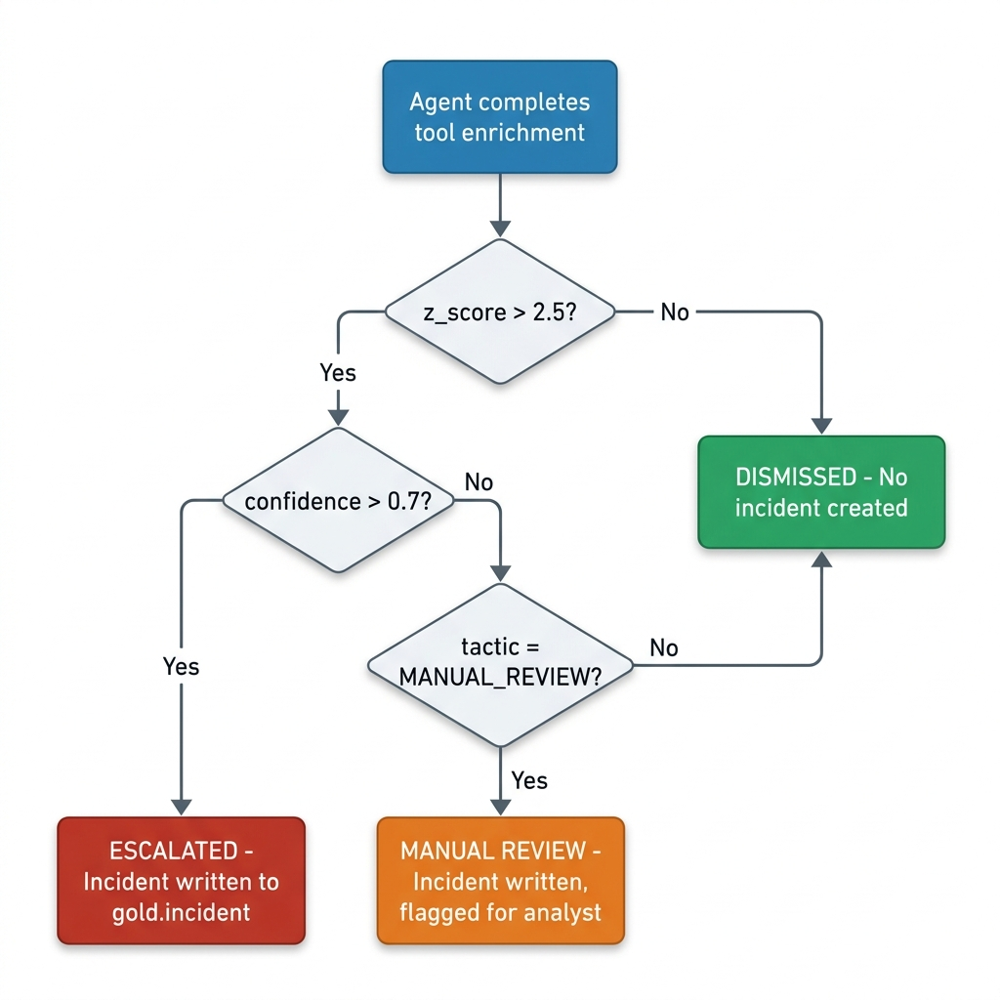
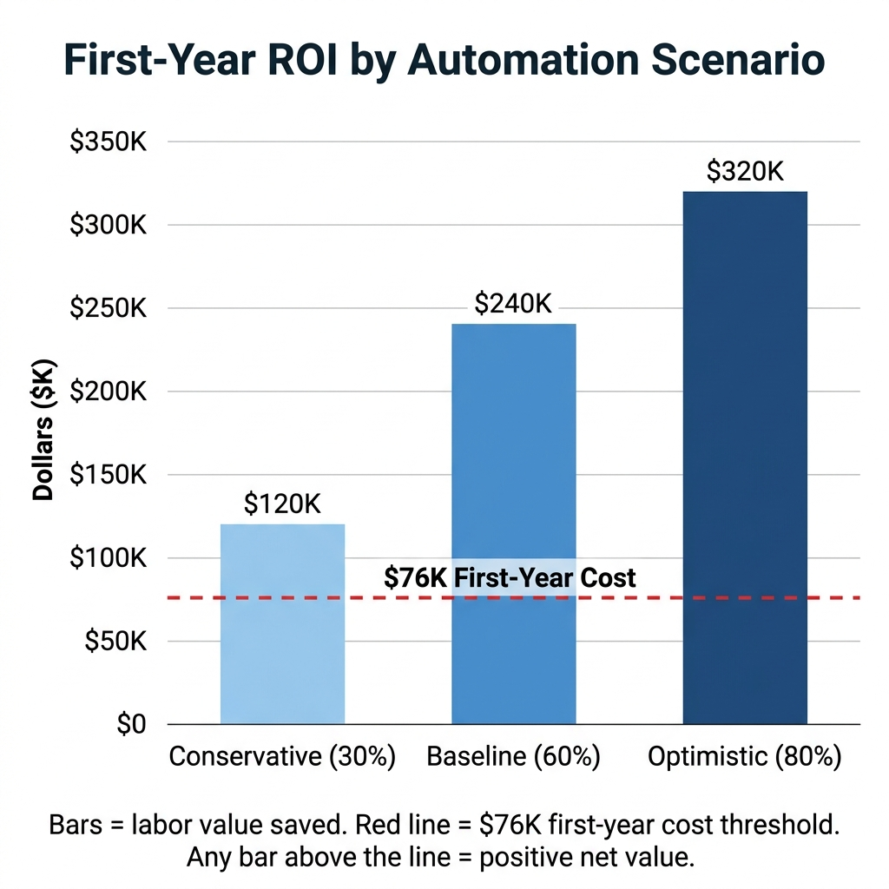
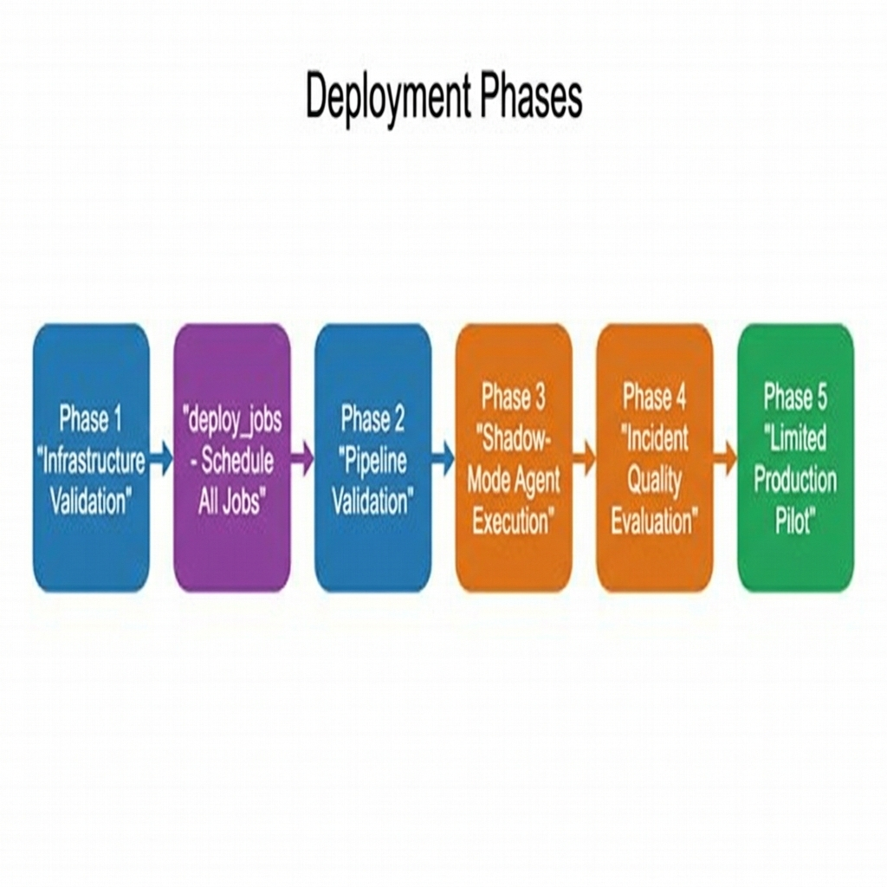

# Business Case: NovaPay Financial SOC Triage Agent

## 1. Business Problem

We are a mid-sized U.S. payments processor handling approximately $2.8 billion in annual transaction volume across more than 400 enterprise clients. Because we operate in the fintech and payments industry, security incidents create direct business risk. A delayed response to suspicious activity can affect customer trust, service availability, fraud exposure, and regulatory readiness.

Our Security Operations Center (SOC) depends on a small analyst team to manually review alerts. Analysts must correlate log entries, check threat intelligence, review vulnerability context, classify suspicious behavior, and write incident tickets. We estimate that analysts review about 30 to 50 alerts per shift, and each alert can take approximately 30 to 45 minutes to investigate.

This creates a scaling problem. High-severity threats can be buried under routine alert noise, while analysts spend much of their time on repetitive lookup and documentation tasks instead of higher-value security judgment. The business problem is not only that triage is expensive; it is that slow or inconsistent triage increases mean time to detect (MTTD) and mean time to respond (MTTR). For a payments company, that delay can turn a manageable alert into a larger security, operational, or customer-impacting event.

## 2. Company Use Case

We will deploy an autonomous SOC triage agent within our SOC. The agent monitors SIEM-style event logs stored in Delta Lake, identifies suspicious activity, enriches the event with threat intelligence, classifies the behavior using MITRE ATT&CK, and generates an incident ticket for analyst review.

The agent follows a ReAct-style design pattern. It reasons about the current alert, chooses a tool, observes the result, and then decides whether another tool call is needed before producing the final classification. Our implementation uses a concrete LangGraph `StateGraph` with explicit nodes for `scope_guard`, `reason`, `act`, and `classify_and_ticket`. This design makes the agent workflow more auditable than a black-box chatbot because the state, tool calls, and routing decisions are visible.

The main tools include:

- `score_anomaly()` for z-score anomaly detection against a per-host rolling baseline, using a p90-filtered robust method that excludes historical spikes.
- `check_ip_reputation()` for IP reputation enrichment. The live Databricks deployment uses AbuseIPDB through a governed Unity Catalog SQL function backed by `http_request()` over a host-locked HTTP connection, while the local package uses a VirusTotal Python wrapper (mocked by default).
- `lookup_exposed_ports()` for governed Shodan exposed-port and service-banner context, also delivered through a Unity Catalog SQL function with `http_request()`.
- `get_cve_context()` for NVD CVE enrichment.

The gold layer also includes two additional Unity Catalog functions that support the pipeline but are not called directly by the ReAct tool-selection loop: `classify_threat()`, a rule-based Python UDF that maps EventID and process signatures to MITRE ATT&CK tactic/technique/confidence, and `get_exposed_assets()`, a table-valued function that returns host-level risk flags based on hostname patterns.

After tool enrichment, the agent routes to the `classify_and_ticket` graph node, which uses the LLM to produce a MITRE ATT&CK classification and generates an incident ticket when the escalation criteria are met.

The agent also includes a scope guard that rejects out-of-scope requests before calling an LLM or tool. This is by design — the agent does not behave like a general chatbot. It stays focused on SOC triage tasks, such as anomaly scoring, host enrichment, CVE context, and MITRE ATT&CK incident ticketing. The implementation also includes a maximum tool iteration cap, structured JSON output enforcement, prompt-injection defenses, and a manual review fallback when classification is uncertain or invalid.

Human analysts remain in the loop. The goal is not to replace SOC analysts or allow the agent to close high-risk incidents automatically. The purpose is to reduce repetitive front-end triage work so analysts can review better tickets, validate escalations, and make final security decisions faster.

The project also includes a one-command demonstration script (`demo_attack.py`) that injects a simulated credential brute-force attack into the silver table, triggers the live agent job, polls it to completion, and reveals the resulting incident and quality evaluation grade. This demonstrates end-to-end pipeline readiness beyond the scheduled hourly cadence.

## 3. Use Case Justification

This use case is justified because SOC triage is repetitive, time-sensitive, and high impact. Analysts are most valuable when they are validating risk, deciding how to respond, and handling incidents that require human judgment. However, the first layer of triage often involves repeatable work that an agent can perform consistently, such as checking whether a host is anomalous, enriching the event with threat intelligence, reviewing CVE context, classifying behavior, and drafting a ticket.

Our current design is stronger than the initial scope because it now has a live Databricks deployment path. The updated design includes an idempotent infrastructure setup notebook, a scheduled mock event injector, an incremental ETL pipeline, a live SOC agent notebook, and a separate incident quality evaluation notebook. This means the system is not only a local prototype; it demonstrates how the workflow can run as scheduled Databricks jobs.

The design was further strengthened after a real production-style issue was discovered and resolved during deployment. The original `score_anomaly()` function produced z-scores of zero for all hosts because historical injection spikes had inflated the 24-hour baseline mean and standard deviation. The function was rebuilt with a p90-filtered robust baseline that excludes per-minute event counts above the 90th percentile from the baseline statistics. This fix was identified through live monitoring, implemented in the Unity Catalog function, and validated through the scheduled pipeline — demonstrating the kind of iterative improvement cycle that justifies a build approach.

The use case is also a good fit for an agentic design because the correct next action depends on intermediate results. A static rule-only workflow may not know whether an alert needs anomaly scoring, IP reputation, exposed-port context, CVE lookup, or manual review. The ReAct loop gives the agent a way to gather context step by step and stop once it has enough information to classify the event.

Another reason the use case is justified is governance. The implementation does not allow the LLM to create incidents without controls. It uses an anomaly-gated escalation rule (in production: `z_score > 1.5`, with high-confidence classifications escalated automatically and uncertain ones routed to manual review instead of being dropped), logs results to MLflow, compares two LLM configurations, and runs a structural quality check on generated incidents. This makes our agent more appropriate for our SOC because it treats the agent as a controlled assistant, not an unrestricted decision-maker.

The following diagram illustrates the escalation decision logic after the agent completes enrichment:



## 4. Build vs. Buy

We will build this SOC triage agent for the prototype and controlled pilot stage instead of immediately buying a fully packaged commercial SIEM or SOAR solution. The main reason is that our agent is already designed around our Databricks lakehouse workflow. The agent uses Delta Lake, Unity Catalog, Databricks jobs, Databricks Model Serving, MLflow, and governed HTTP connections, which makes it easier to align with our internal data platform.

Buying a commercial platform could provide mature features, vendor support, service-level agreements, and prebuilt integrations. That may be useful later if NovaPay needs broad enterprise coverage or vendor-managed operations. However, a commercial tool may also introduce additional platform costs, ingestion costs, storage costs, and customization limits. It may not be tuned to our specific telemetry, SOC workflow, or payments-related threat priorities.

Building the agent gives us more control. We can define the escalation logic, choose the LLM configuration, decide how external enrichment is called, and keep incident data inside our Databricks environment. The updated implementation strengthens our case for building internally because it uses Unity Catalog functions and governed HTTP connections for AbuseIPDB and Shodan, with API keys handled through Databricks secrets instead of being hardcoded in notebooks. Notably, the enrichment functions are implemented as SQL functions using `http_request()` over host-locked HTTP connections rather than Python UDFs, because Unity Catalog Python UDFs run in a network-sandboxed environment that cannot reach the internet. This architectural choice demonstrates the depth of platform-specific knowledge that a build approach provides.

Additional build advantages include:

- **Modular reusable package.** The agent logic is organized into a `src/soc_agent/` Python package with separate modules for configuration, mocking, API clients, gold-layer tools, LLM selection, agent orchestration, and evaluation helpers. This modularity makes components independently testable and replaceable.
- **Automated test coverage.** The implementation includes a `pytest` test suite covering escalation gate boundary conditions, scope guard behavior, and mock fixture validation. For a security-critical system, this test infrastructure strengthens confidence in correctness.
- **Infrastructure-as-code deployment.** The `deploy_jobs` notebook (and a companion `deploy_jobs.ps1` PowerShell script for local-admin deployment) is self-locating, idempotent, and creates all five scheduled jobs from a fresh git checkout with no hardcoded paths.
- **Fully env-configurable LLM.** Provider and model names are selected entirely through environment variables (`LLM_PROVIDER`, `LLM_MODEL`, `LLM_MODEL_B`), supporting Databricks Model Serving, OpenAI, or a creds-free mock provider with zero code changes. This means the agent can be pointed at future models without modifying the codebase.

Building internally does require more ownership. We will need to maintain the scheduled jobs, validate the data pipeline, monitor model behavior, review incident quality, and manage external API quotas. However, for this stage, building is the better choice because it gives us a working proof of concept, a clearer understanding of our own data, and a safer path to a controlled production pilot.

## 5. ROI Estimate Using Databricks DBU Pricing

The ROI estimate compares the cost of manual SOC triage with the expected cost of operating our Databricks-native agent on AWS. Our project runs on **Databricks serverless compute** (no classic clusters are available in this workspace), and all five scheduled jobs execute as **Lakeflow Jobs Serverless** workloads. LLM inference uses **Databricks Foundation Model APIs** (pay-per-token), which is priced separately from DBU-based compute.

The following table summarizes the Databricks compute types and rates relevant to this project:

| Compute Type | AWS Rate | Our Usage |
|---|---:|---|
| Lakeflow Jobs Serverless | $0.40/DBU | All scheduled notebooks (ETL, agent, eval, injector) |
| SQL Serverless Compute | Usage-based | UC functions run inside Jobs notebooks via `spark.sql()`, not a separate SQL Warehouse |
| Foundation Model APIs | Per-token | `databricks-meta-llama-3-3-70b-instruct` inference for classification |

Estimated Databricks compute cost (Jobs Serverless):

```text
Up to 550 DBU-hours/month x $0.40 per DBU = $220/month
$220/month x 12 months = $2,640/year (planning ceiling)
```

Estimated Foundation Model API cost (LLM inference):

```text
Foundation Model API estimate = up to $3,000/year (planning ceiling)
(sized for ~288 agent runs/day; the deployed staggered hourly cadence of
24 triage cycles/day — inject :00, ETL :10, agent :20, eval :25:30 —
uses roughly 1/12 of that volume at ~1-2K tokens/run)
```

Estimated annual platform operating cost:

```text
$2,640 Jobs Serverless compute + $3,000 Foundation Model APIs = $5,640/year
Rounded planning ceiling = ~$6,000/year
(the measured hourly cadence puts actual run-rate well below this ceiling;
we keep $6,000/year as the conservative figure for ROI math)
```

The one-time prototype implementation cost is estimated at $60,000 to $80,000. This includes engineering time, security review, testing, change management, scheduled job setup, data validation, and integration work. Using the midpoint of $70,000, the first-year cost estimate is:

```text
Implementation midpoint = $70,000
Annual platform operating cost = $6,000
Total first-year project cost = $76,000
```

This cost is small compared with the estimated manual triage labor pool of about $400,000 per year. The project does not need to replace analysts or automate all alert handling to create value. It only needs to reduce enough repetitive triage work to offset the first-year implementation and operating cost.

These planning figures are anchored to measured system behavior rather than hypothetical throughput. As of June 11, 2026 (the most recent live query), the deployed pipeline has ingested **52,043 raw events** into Bronze, normalized **41,570 events** into Silver, and written **20 incidents** to `gold.incident` (15 HIGH severity; 9 routed to manual review), with **14 structural quality evaluations** in `gold.incident_eval` averaging a **0.757 quality score**. That is an escalation rate of roughly **0.05% of normalized events** — the agent absorbs the alert noise and surfaces a short, enriched queue for analysts. These counts will continue to grow as the pipeline runs on its staggered hourly cadence (`mock_event_injector_v2` at :00, `soc_etl_pipeline_v2` at :10, `soc_agent_live` at :20, `incident_eval_agent_v2` at :25:30). The full derivation and sensitivity analysis are in [`docs/roi_calculation.md`](roi_calculation.md).

## 6. Analyst Cost, Alerts per Shift, and MTTD/MTTR Improvement

The manual savings calculation starts with analyst time. The estimate assumes about 30 alerts per shift, 37.5 minutes per alert, 250 working days per year, and a fully loaded analyst cost of $85 per hour. Each avoided manual triage is therefore worth about **$53 of analyst time** (37.5 min × $85/hr).

Manual triage hours:

```text
30 alerts/shift x 37.5 minutes/alert = 1,125 minutes per shift
1,125 minutes / 60 = 18.75 analyst-hours per shift
18.75 analyst-hours/shift x 250 working days = 4,687.5 hours/year
Rounded estimate = ~4,700 analyst-hours/year
```

Manual triage labor cost:

```text
4,700 hours/year x $85/hour = $399,500/year
Rounded estimate = ~$400,000/year
```

The annual savings depends on how much repetitive triage work the agent can safely reduce. This business case uses three automation scenarios:

| Scenario | Automation Rate | Analyst Hours Saved | Labor Value Saved | First-Year Net Value |
|---|---:|---:|---:|---:|
| Conservative | 30% | 1,410 hours | ~$120,000 | ~$44,000 |
| Baseline | 60% | 2,820 hours | ~$240,000 | ~$164,000 |
| Optimistic | 80% | 3,760 hours | ~$320,000 | ~$244,000 |

Using the $76,000 first-year cost estimate:

```text
Conservative: $120,000 - $76,000 = $44,000 first-year net value  (~0.6x ROI)
Baseline: $240,000 - $76,000 = $164,000 first-year net value  (~2.2x ROI)
Optimistic: $320,000 - $76,000 = $244,000 first-year net value  (~3.2x ROI)
```

Our headline figure is the baseline scenario: **~$240,000 per year of analyst labor value recovered for a ~$76,000 first-year cost (~$164,000 net, roughly 2.2x first-year ROI)**. In subsequent years the recurring cost drops to the ~$6,000 platform ceiling, so even the conservative scenario returns more than 15x annually once implementation is paid off.

The following chart compares each scenario's labor savings against the $76,000 first-year project cost:



> The bars represent labor value saved per scenario. The line marks the $76K first-year cost threshold — any bar above the line represents positive net value.

The MTTD and MTTR improvement is harder to price directly because we do not yet have production incident timing data. However, the expected operational improvement is clear. The agent reduces the time between alert generation and analyst-ready ticket creation by handling scoring, enrichment, classification, and ticket drafting. This will improve MTTD because suspicious events are surfaced faster, and it will improve MTTR because analysts start with a clearer incident summary instead of raw logs.

We frame the MTTD and MTTR benefit as risk reduction rather than guaranteed breach-cost savings. We expect the agent to support faster triage and response, but a production pilot is needed before assigning a precise dollar value to MTTD or MTTR improvement.

## 7. Build vs. Buy Comparison

| Option | Advantages | Disadvantages | Recommendation |
|---|---|---|---|
| Continue manual triage | No new platform cost; analysts keep full control | Slow, expensive, inconsistent, does not scale, increases alert fatigue | Not recommended as the long-term approach |
| Buy commercial SIEM/SOAR | Mature vendor features, support, integrations, enterprise readiness | Potential ingestion and platform costs; less customized to our data and threat model | Worth comparing later, but not the best prototype choice |
| Build Databricks-native agent | Uses existing lakehouse architecture; customizable; measurable; human-in-the-loop; governed enrichment; scheduled deployment path | Requires internal ownership, monitoring, testing, baseline tuning, and API management | Recommended for proof of concept and controlled pilot |

The build option is strongest for this initiative because we now have a working implementation path rather than only a conceptual design. The Databricks deployment includes idempotent infrastructure setup, scheduled jobs, governed external HTTP connections, incremental ETL, live agent execution, MLflow logging, and incident quality evaluation.

The buy option may still be useful as a future benchmark. Once we measure actual alert volume, data volume, analyst time saved, false positive rate, false negative rate, and incident quality, we can compare our internal agent against a commercial platform with better evidence. At this stage, building gives us more learning value and more control.

## 8. LLM ROI Comparison

Our agent compares two LLM configurations on the same alert context. The live Databricks deployment uses `databricks-meta-llama-3-3-70b-instruct` as both Model A and Model B, differentiated by temperature. Model A runs at temperature `0.0` and writes incidents when the escalation gate is met. Model B runs at temperature `0.5` and is used for comparison only. The local package defaults to `databricks-meta-llama-3-1-70b-instruct` (Model A) and `databricks-dbrx-instruct` (Model B), but all model selections are fully configurable via environment variables (`LLM_PROVIDER`, `LLM_MODEL`, `LLM_MODEL_B`) with no code changes required. The `get_llm()` factory supports Databricks Model Serving, OpenAI, and a creds-free `mock` provider.

This comparison is useful because it separates production action from evaluation. Model A is deterministic and better suited for auditability, while Model B allows the team to observe whether a more variable configuration changes confidence, tactic selection, or decision quality. The agent logs these results to MLflow (experiment: `/Shared/msaai-510-group8-soc-triage-agent/soc_triage_agent`) so the team can compare z-score, confidence, latency, decision, tactic agreement, and whether an incident was written. Each host triage run is recorded as a separate MLflow run with structured params, metrics, and tags.

From a business perspective, the recommended model is Model A because deterministic behavior is more appropriate for SOC triage. In a security workflow, reproducibility matters. Analysts and auditors should be able to understand why an incident was created and expect similar inputs to produce similar outputs.

The LLM ROI depends less on small latency differences and more on whether the model supports safe automation. If Model A can generate consistent MITRE labels, valid incident fields, and analyst-ready ticket context while keeping false negatives low, it provides stronger business value than a more variable configuration. The main financial value comes from reducing analyst minutes per alert, not from minor differences in model response time.

For production approval, we will calculate cost per triage run for both configurations using real Databricks serving costs. The comparison will include model latency, token usage, incident quality, false positive rate, false negative rate, and analyst acceptance rate. Until that data is available, we will use Model A as the pilot model and keep Model B as a monitoring and comparison configuration.

## 9. Deployment Recommendation

We have deployed in a phased Databricks pilot, not an immediate full-production rollout. Our current implementation has moved beyond design into an operational state: live Databricks notebooks, scheduled jobs running on a staggered hourly cadence, governed external enrichment, MLflow tracking, synthetic event injection, incremental ETL, and structural incident evaluation are all active.



Phase 1 (complete) is infrastructure validation. We ran `00_setup_infrastructure` to create the catalog, schemas, Gold tables, Unity Catalog functions, governed HTTP connections, and incident evaluation table. This confirmed that the environment is reproducible from a fresh checkout and that secrets are not hardcoded.

After infrastructure was in place, the `deploy_jobs` notebook (`deploy_jobs.py`, with a companion `deploy_jobs.ps1` PowerShell script for local-admin deployment) created and scheduled all five Databricks jobs (`setup_infrastructure`, `mock_event_injector_v2`, `soc_etl_pipeline_v2`, `soc_agent_live`, and `incident_eval_agent_v2`). This notebook is idempotent and auto-detects its repo location, so no hardcoded paths or external CLI tools are required.

Phase 2 (complete) is pipeline validation. The `mock_event_injector_v2` generates synthetic SIEM events into Bronze on its hourly schedule, and the `soc_etl_pipeline_v2` normalizes those events into Silver. This validated the full Bronze-to-Silver path and confirmed that the agent is not only working on static fixtures.

Phase 3 (active) is shadow-mode agent execution. The `soc_agent_live` job runs on a schedule, reviews active hosts, calls live Databricks tools, compares both LLM configurations, and logs results to MLflow. Generated incidents are reviewed by humans before they are treated as operationally actionable.

Phase 4 (active) is incident quality evaluation. The `incident_eval_agent_v2` evaluates new incidents for valid MITRE tactic, valid technique format, valid confidence range, valid severity, and z-score threshold compliance. This gives the team a second layer of quality control and helps determine whether the agent is producing analyst-ready tickets.

Phase 5 (upcoming) is limited production pilot. Once we validate that the anomaly baseline is stable, the escalation gate is working, and incident quality is acceptable, we will run the agent alongside our SOC workflow. Analysts will approve or reject agent-generated tickets, and those decisions will be used to tune thresholds and measure actual time savings.

We are proceeding with a controlled Databricks pilot using Model A as the incident-writing configuration, Model B as the comparison configuration, and human analysts as the final decision-makers.

## 10. Limitations

The first limitation is that we are at the proof-of-concept stage, so the financial estimates are planning assumptions rather than measured production numbers. Actual ROI would require real alert volume, analyst timing data, Databricks billing data, model serving usage, and incident outcome data.

The second limitation is that we still use synthetic and simulated data. OTRF datasets and mock event injection are useful for proving the workflow, but they do not fully represent our production telemetry, user behavior, network architecture, or threat landscape.

The third limitation is that the mock event injector is test-only. It is useful because it exercises the Bronze-to-Silver-to-agent path and creates spike behavior for z-score testing, but a production deployment would need to replace it with a real SIEM or telemetry feed.

The fourth limitation is API dependency. The live version uses governed HTTP functions for AbuseIPDB and Shodan, and it uses NVD for CVE enrichment. Production use would need paid tiers or quota planning, API monitoring, fallback behavior, and clear governance around external data sources.

The fifth limitation is that `get_cve_context()` remains a direct NVD REST call inside the agent rather than a fully migrated Unity Catalog function. This works for the project, but for production it would be cleaner to move CVE enrichment into the governed data layer so ownership and auditing are consistent.

The sixth limitation is that LLM-generated classifications still require oversight. Our system includes structured output expectations, manual review fallback, incident evaluation, and human-in-the-loop review, but an LLM can still misclassify behavior or produce inconsistent summaries. The system is designed to support analysts, not replace them.

The seventh limitation is cost uncertainty. The DBU estimate is based on planning assumptions, not a final production billing export. Before deployment, we will calculate actual DBU usage, model serving cost, external API cost, and analyst review time saved.

The eighth limitation is interface drift between the shipped gold-layer functions and the original proposal contract. The `score_anomaly()` function was shipped as a table-valued function with window specified in minutes (`p_window_min INT`) rather than the originally proposed scalar function with window in days. The agent-side tool wrappers adapt to the shipped reality, but this means the codebase has adaptation layers that would need to be maintained if the gold layer changes again.

The ninth limitation is a schema difference between the local and live `gold.incident` tables. The live Databricks deployment includes a `model_used` column that tracks which LLM generated each classification, while the local `src/soc_agent/` package does not write this column. This means local mock-mode incidents and live incidents have slightly different schemas.

The tenth limitation is a threshold mismatch between the escalation gate and the quality evaluation. The agent escalates incidents when `z_score > 1.5`, but the `incident_eval_agent` grades z-score validity using a stricter threshold of `z_score >= 2.5`. This means incidents with z-scores between 1.5 and 2.5 are correctly escalated by the agent but receive a z-score penalty in the quality evaluation, which contributes to the average quality score of 0.757 rather than a higher figure. This discrepancy is intentional (the eval applies a stricter bar than the escalation gate), but it should be understood when interpreting quality grades.

The eleventh limitation is the absence of incident deduplication. The agent processes every host with recent events on each hourly run. If a host remains anomalous across multiple consecutive runs (for example, during a sustained attack that produces high z-scores for several hours), the agent will create a new incident each time because there is no check for an existing open incident (`resolved_at IS NULL`) for the same host before writing. In production, this would generate duplicate incidents for persistent threats and inflate the analyst review queue. A deduplication check or cooldown window would be needed before full production use.

Overall, our SOC triage agent is ready to support a controlled pilot. It addresses a clear business problem, has a working Databricks deployment path, measurable ROI assumptions, and governance controls. However, full production deployment should wait until we validate real data behavior, incident quality, API reliability, and analyst acceptance.
